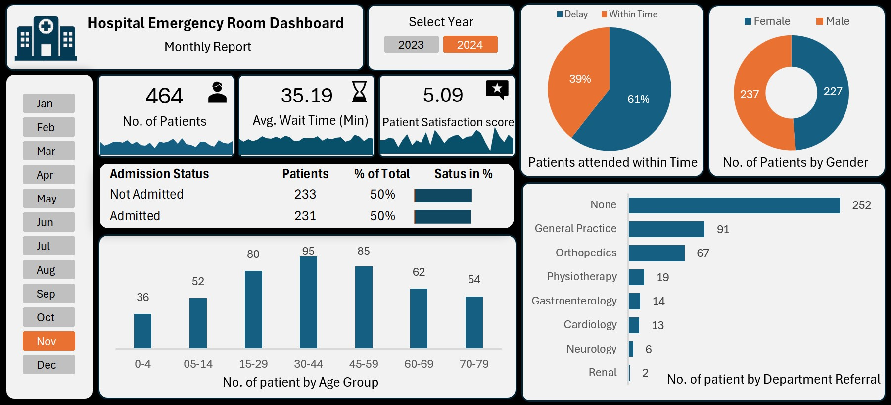

# Data-Analyst-Portfolio
My Data Analyst Projects Portfolio
# 👋 Hi, I'm Vishal Dubey

🎯 Aspiring Data Analyst | Turning Data into Insights
---
## 🧑‍💻 About Me
I am a passionate Data Analyst fresher with a strong foundation in data analysis, visualization, and problem-solving.

🎓 B.Tech in Electronics & Telecommunication (CGPA: 8.11)  
📊 Skilled in Excel, SQL, Power BI, Python & Tableau  
💡 Interested in transforming raw data into meaningful business insights  
---
## 🛠️ Skills
**📊 Data Analysis:** Data Cleaning, Data Visualization, Data Interpretation  
**📈 Tools:** Excel, Power BI, Tableau  
**🗄️ Database:** SQL (MySQL)  
**🐍 Programming:** Python (Pandas, NumPy, Matplotlib)  
---
## 📂 Projects

### 🏥 Hospital Data Dashboard
📌 Analyzed hospital data to improve operational efficiency  
🔗 [View Project](./Hospital-Dashboard)

---
### 📊 Sales Data Analysis *(Coming Soon)*
📌 Sales trends, profit analysis, and business insights  

---

### 🛒 E-commerce Analysis *(Coming Soon)*
📌 Customer behavior and product performance analysis  

---

### 🚚 Supply Chain Analysis *(Coming Soon)*
📌 Inventory and delivery performance optimization  

---

## 📸 Featured Project Preview

---

## 📬 Contact Me

📧 Email: your-email@gmail.com  
🔗 LinkedIn: your-linkedin-link  

---

## 🚀 Goal

To start my career as a Data Analyst and grow into a high-impact data professional by solving real-world business problems using data.

---

⭐ If you like my work, feel free to connect!
